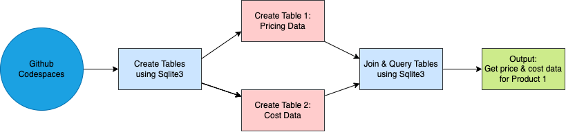
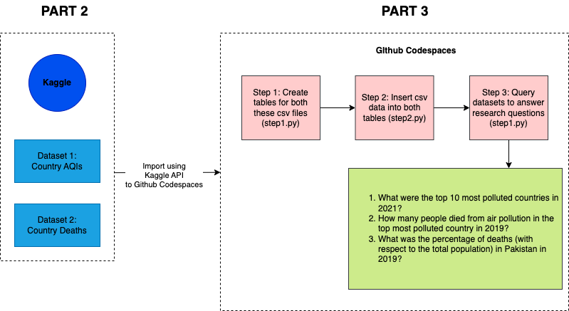

# Project 3: Generate a script that queries a database: Sqlite.

In this project, I will be doing three different things with Sqlite.
1. Generating a script that creates and queries a database using Sqlite
2. Loading Datasets from Kaggle using Kaggle API
3. Quering datasets from Kaggle to answer important research questions

## Part 1: Generate a script that creates and queries a database using Sqlite (script.py):

1. install pysqlite3
2. build the script.py file to create the table: 
    i. define a connection (connection is used to connect to a database - pass in the name of the dataset, if you are referencing a new one then a new database will be created)
    ii. create a cursor (a cursor interacts with the database through sql commands - this will allow us to create and modify tables in our database)
3. Create the tables (products & costs)
4. Query the table using sql joins

Demo for Part 1 linked [here](https://prodduke.sharepoint.com/:v:/r/sites/IDS.721.01.Sp22/Shared%20Documents/Week%208%20Demo/Kashaf_Week%208%20Demo.mp4?csf=1&web=1&e=W8UD7K)

Here is a combined summary of Part 2 and 3:

## Part 2: Load Climate Change Datasets using Kaggle API:

1. install kaggle - add to requirements file
2. create a directory with mkdir /home/codespace/.kaggle
3. copied the dataset to /home/codespace/.kaggle using 
cp /workspaces/Project3_Kashaf/kaggle.json /home/codespace/.kaggle
4. change permissions using 
chmod 600 /home/codespace/.kaggle/kaggle.json
5. load dataset using Kaggle API (copy this from Kaggle): 
kaggle datasets download -d howardforbes/air-quality-index-by-cities
kaggle datasets download -d ahmadjalalmasood123/deaths-by-risk-factor-dataset
6. unzip the file and copy paste in the data directory

Demo for Part 2 linked [here](https://prodduke.sharepoint.com/:v:/r/sites/IDS.721.01.Sp22/Shared%20Documents/Week%209%20Demo/add%20KAGGLE%20dataSET%20from%20csv%20to%20the%20database%20using%20SQLite3.mp4?csf=1&web=1&e=bZ2Dur)

## Part 3:  Quering datasets from Kaggle to answer important research questions:

1. Use two imported Kaggle datasets from part 2: (i) AQI data for all countries between 2018-2021 from [here](https://www.kaggle.com/datasets/howardforbes/air-quality-index-by-cities?select=AIR+QUALITY+INDEX-+top+countries.csv), 
and (ii) Deaths due to different risk factors for all countries for different years from [here](https://www.kaggle.com/datasets/ahmadjalalmasood123/deaths-by-risk-factor-dataset?select=Number+of+Deaths+by+Risk+Factors.csv).
2. Create tables for both these csv files (step1.py)
3. Insert csv data into both tables (step2.py)
4. Query datasets to answer the following research questions:

    i. What were the top 10 most polluted countries in 2021?
    
    Terminal command:  python -c 'import step3; step3.qi()'
    
    ii. How many people died from air pollution in the top most polluted country in 2019?
    
    Terminal command:  python -c 'import step3; step3.qii()'
    
    iii. What was the percentage of deaths (with respect to the total population) in Pakistan in 2019?
    
    Terminal command:  python -c 'import step3; step3.qiii()'
    
Demo for Part 3 linked [here](https://prodduke.sharepoint.com/:v:/r/sites/IDS.721.01.Sp22/Shared%20Documents/Week%2010%20Demo_Project%203/Project%203.mp4?csf=1&web=1&e=sMfxUv)

   
